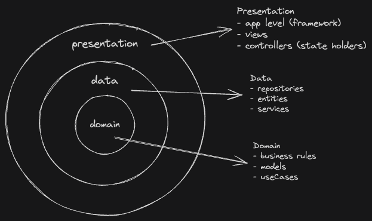

### @star-wars-characters

This is a Next.js application that displays information about characters from the Star Wars universe. You can browse through a list of characters, view detailed information about each of them, and filter characters by planets. The application fetches data from [Star Wars API](https://swapi.dev/) and presents it in an easy-to-navigate interface.

Production URL: https://star-wars-characters-five.vercel.app/

#

- **[Features and Architecture](#features-and-architecture)**
- **[Technical Resources](#technical-resources)**
- **[Getting Started](#getting-started)**
  - **[Running unit tests](#running-unit-tests)**

<br>


<br>
<br>

# Features and Architecture

This project is built on top of concepts like [Layered Architecture](https://www.oreilly.com/library/view/software-architecture-patterns/9781491971437/ch01.html) and [Separation of Concerns](https://www.geeksforgeeks.org/separation-of-concerns-soc/). We have a main `feature` that shows a list of the characters from Star Wars universe provided by **Star Wars API**, also we provide an option to filter the results by planets.

This project uses a modularization approach, to organize and follow the best architecture guidelines, as you can see in the representation of the main layers below:

<br/>
  
<br/>

Take a look into how the app's folder structure looks like:

```
.
├── app                    # app level (framework)
│
├── components             # common ui components
│   ├── atoms
│   ├── layout
│   └── molecules
│
├── modules
│   ├── characters
│   │    ├── data           # centralize changes in data and resolves external sources
│   │    ├── di             # dependency injection container
│   │    ├── domain         # business rules and models
│   │    └── presentation   # ui code for this module
│   │
│   └─── core
│        └── ...
.
```

# Technical Resources

- Layered architecture, SOLID and atomic design concepts
- Usage of a simple state management with native hooks
- Unit tests with Jest
- Responsive version using Media Query rules
- CI workflow with GitHub Actions
- Usage of Tailwind CSS and CSS Motion Animations
- Usage of Next.js, React and TypeScript
- Accessibility implementations for UI components
- Context API from React to distribute state across components
- Next Api Route Handler

# Getting Started

1. First you need to setup your environment with Node.js, you can find more information in the [official docs](https://nodejs.org/en).

- After setting up your Node env, you'll need to install `pnpm`, as this project uses it to manage dependencies.

```shell
brew install pnpm # for macOS
npm i -g pnpm # using node
```

- For more options, head to the [documentation](https://pnpm.io/installation).

2. After that, clone this repository in your local machine.

```shell
git clone https://github.com/WillACosta/star-wars-characters.git
```

3. Go to the place you cloned the repository and runs the following command in the root path, to get a copy for `.env` file, and fill it with the proper values.

```shell
cp .env.example .env
# open the file and add the SW API URL (Get on https://swapi.dev/)
```

4. Finally, run the following command in a terminal (still in the root path):

```shell
pnpm dev
```

5. Now you should be able to visit `localhost:3000` and see the application in action.

## Running unit tests

Just run the following command in a terminal:

```shell
pnpm test
```
